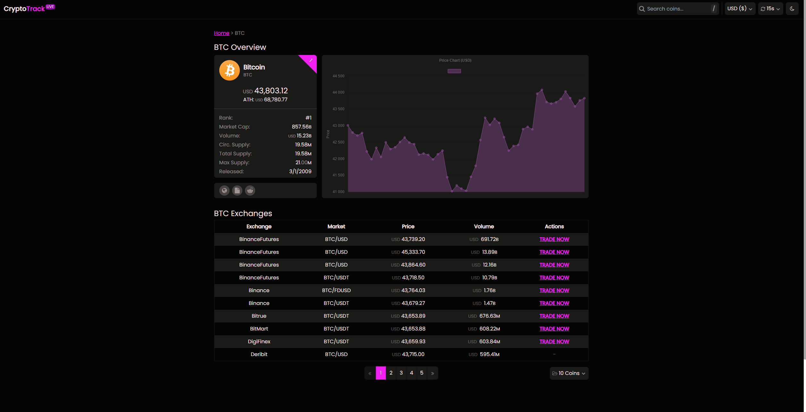

# CryptoTrackLive

## Description

Track prices of many cryptocurrencies, with charts, sorting, currency converting, and more.
Try it yourself: [https://cryptotrack-live.vercel.app](https://crypto-track-zunwdev.vercel.app)

## Important

Data are updated once user changes any of settings, i.e. currency, update rate, it can be live if you uncomment marked parts of code in Data.svelte (expect higher usage of your daily credits on API.)

(If the updating is live and you tab out the page it will stop updating, it will start again if you are on the page)

## Features

- Responsive design
- Live data (live data are currently off, due to daily API limitations)
- Sort coins directly in table
- Search coins
- View coin details - WIP
- Minimalistic design
- Dark/light mode
- Currency convert
- More features to come...

## 🔨 Contributing

If you really want to contribute, I'm open for any contributions. Just be **aware**, the API that I use is really limited, since I can't afford any better like [CoinGecko](https://www.coingecko.com/en/api)

### How to run the application on your local device

1. Create a fork of this app
2. Import it to your code editor
3. When you are in the CryptoTrack folder, do `npm install`
4. Go to [LWC](https://www.livecoinwatch.com/tools/api) and [CoinStats](https://openapi.coinstats.app) get your API key
5. Create an .env file, and insert here `VITE_API_KEY=your lwc key` and `VITE_CS_API_KEY=your coin stats key`
6. Run `npm run dev`

!Don't put your API key into public!

### To contribute do

1. Before contributing run `npm run build` to check if everything is fine and get latest version of the app
2. If the build output has no errors, you are ready to make a pull request

## License

[MIT](https://github.com/ZunwDev/CryptoTrack/blob/main/LICENSE)

## How it looks:

### Home Page

### Detail Page (WIP):

## Check CHANGELOG.md for updates & changes

### Resources

- [LiveCoinWatchAPI](https://www.livecoinwatch.com/tools/api)
- [CoinStatsAPI](https://openapi.coinstats.app)
- [ChartJS](https://www.chartjs.org)
- [svelte-awesome](https://www.npmjs.com/package/svelte-awesome)
